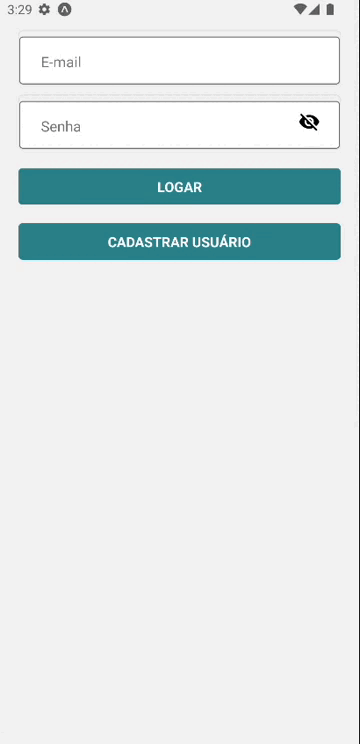

<a href="https://www.linkedin.com/in/henri-marques/">
 
 <br />
 <sub><b>Henrique Marques</b></sub></a> <a href="https://www.linkedin.com/in/henri-marques/" title="Linkedin">🧑🏻‍💻
 </a>


Made with ❤️ by Henrique Marques 👋🏽 Say hello!

[](https://twitter.com/Henrimarques18) [](https://www.linkedin.com/in/henri-marques/) 
[](mailto:hmservicostech@outlook.com.br)

---
<!-- <h1 align="center">
    
</h1> -->

<!-- https://alura-github-thumbnail-generator.vercel.app/ -->

<h4 align="center"> 
	Sports
</h4>

<p align="center">
  <a href="#information_source-o-que-é-o-aluraesporte">What is the Sports App?</a>&nbsp;&nbsp;&nbsp;|&nbsp;&nbsp;&nbsp;
  <a href="#rocket-Tecnologias">Technologies</a>&nbsp;&nbsp;&nbsp;|&nbsp;&nbsp;&nbsp;
  <a href="#information_source-como-usar">How to use</a>&nbsp;&nbsp;&nbsp;|&nbsp;&nbsp;&nbsp;
</p>

## :information_source: Whats is the Sports App?

the Sports is an application made in React Native that allows users to find sports products. This application has integrated Firebase so that users can register and log in.

This project is used in the Firebase formation of React Native of the Alura platform.

<h1 align="center">
    
</h1>


## :rocket: Tecnhologies

This project was developed using the following technologies
- [React Native][rn]
- [Expo][expo]

## :information_source: How to use

To copy and run this application, you need three prerequisites: 
[Git](https://git-scm.com), [Node.js][nodejs] + [Yarn][yarn] intalados no seu computador.

On shell, type the following commands:

### Download and Install the program

```bash
# Clone this repository
$ git clone https://github.com/alura-cursos/react-native-firebase-authentication.git

# Go to repository
$ cd react-native-firebase-authentication

# Install the dependencies
$ npm install
```

### Execute the mobile

```bash
# Execute in another terminal (inside Sports Folder)
$ expo start
```
[nodejs]: https://nodejs.org/
[expo]: https://docs.expo.dev/
[rn]: https://facebook.github.io/react-native/
[yarn]: https://yarnpkg.com/